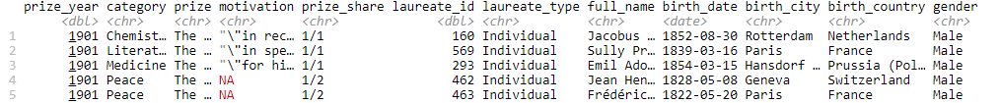
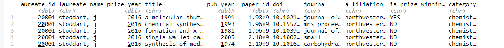
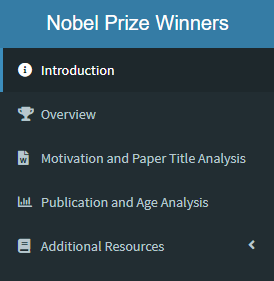

# Agenda

1. Overview of Data

1. Purpose of Application

1. Design Process

1. Demo

1. Future Work

1. Questions


---

# Overview to Data

## Data Utilized for Project
- All past Nobel Prize Winners - [Kaggle](https://www.kaggle.com/nobelfoundation/nobel-laureates#archive.csv)
- All publications by Nobel Prize winners in three categories - [Harvard Dataverse](https://dataverse.harvard.edu/dataset.xhtml?persistentId=doi:10.7910/DVN/6NJ5RN)
  - Chemistry
  - Medicine
  - Physics
  
<strong>Nobel Winners</strong>

.center[

]

<strong>Nobel Winners - All Publications</strong>

.center[

]

---

# Purpose of Application

<strong>Purpose:</strong> This application is to provide insights to the Swedish and Norwegian institutions responsible for awarding the Nobel Prize.

--

## Why

1. It will assist in the decision making process for future Nobel Prize recipients. 

1. It will help these institutions identify biases, disparities and gaps.

1. It will act as a source of historical information for these institutions.

---

# Design Process

## Layout of Dashboard

.pull-left[

1. Introduction

1. Overview

1. Motivation and Paper Title Analysis

1. Publication and Age Analysis
]

.pull-right[
.right[
<br>

]
]
---

# Design Process

### User
- Shiny Dashboard
- Validate
- Waiter

### Production
- Functions
- Reactive functions
- Breaking up the code

---

# Design Process

Validate
```{r eval=FALSE}
output$motivation_wordcloud <- renderPlot({
        validate(
                need(motivation_freq()$n != "", "No Data Available")
        )
```

---

# Demo

[Link to App](https://japeterson.shinyapps.io/updated-app/)

---

# Future Work

--

1. Improve UI and visualizations for improved usability
  - Download buttons for tables
  - Improve reactivitity of plots and tables to filtering
  - Improve performance of application (caching of plots, analyze performance via shinyloadtest, etc.)

--

1. Provide more analysis around potential biases and gaps
  - Better comparisons among groups of interest
  - Utilize statistical tests to potentially find evidence of bias 
  
--

1. Provide more support for insights
  - More descriptive language to help with interpretation
  - Provide more information concerning sample sizes, number of observations, etc.

---

class: center, middle
<font size=36 color=#00703c><b>Questions?</b></font>

---
class: center, middle

<font size=36 color=#00703c><b>Thanks!</b></font>
<br>
Slides created via the R package [**xaringan**](https://github.com/yihui/xaringan).

---

# Links

Shiny App - [GitHub repo](https://github.com/joshapeterson/dsba5122-class-project) & [Deployed App](https://japeterson.shinyapps.io/updated-app/)


